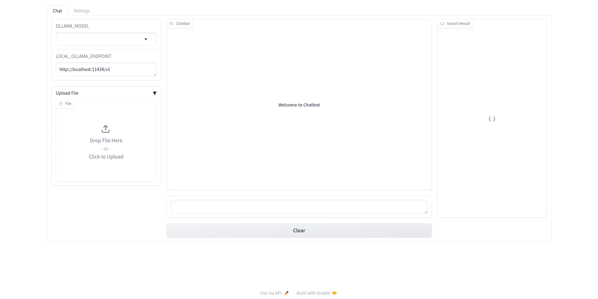

# LLM Chatbot Web UI

This project is a Gradio-based chatbot application that leverages the power of LangChain and Hugging Face models to perform both conversational AI and PDF document retrieval. The chatbot is capable of handling text-based queries, generating responses based on Large Language Models (LLMs), customize text generation parameters and retrieving information from uploaded PDF documents.



## Features

* Provides Generation Parameters Control
  - temperature
  - token limit
  - top-p
* Provides Search Parameters Control
  - k
* Provides a Clear Button to Reset the Conversation in the Interface
* Supports PDF-Based Retrieval-Augmented Generation (RAG)
* Supports embedding model
  - [all-MiniLM-L6-v2](https://huggingface.co/sentence-transformers/all-MiniLM-L6-v2)
* Supports text generation model
  - [all models listed in Ollama](https://ollama.com/library)

## Getting Started

1. Clone this repository:

```bash
git clone https://github.com/QinWenFeng/llm-chatbot-web-ui.git
cd llm-chatbot-web-ui
```

2. Create virtual environment:
```bash
python3 -m venv venv
```

3. Activate virtual environment:
```bash
# Ubuntu
source venv/bin/activate
```

4. Install the required dependencies:

```bash
pip install -r requirements.txt
```

## Usage

1. Run the following command to start the chatbot interface:

```bash
python3 app.py
```

2. Once the server is running, open your web browser and navigate to http://127.0.0.1:7860 to access the chatbot interface.

## Star History

[](https://star-history.com/#QinWenFeng/llm-chatbot-web-ui&Date)